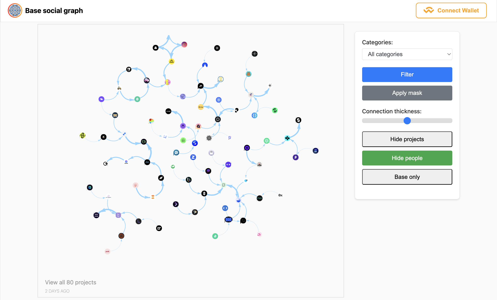
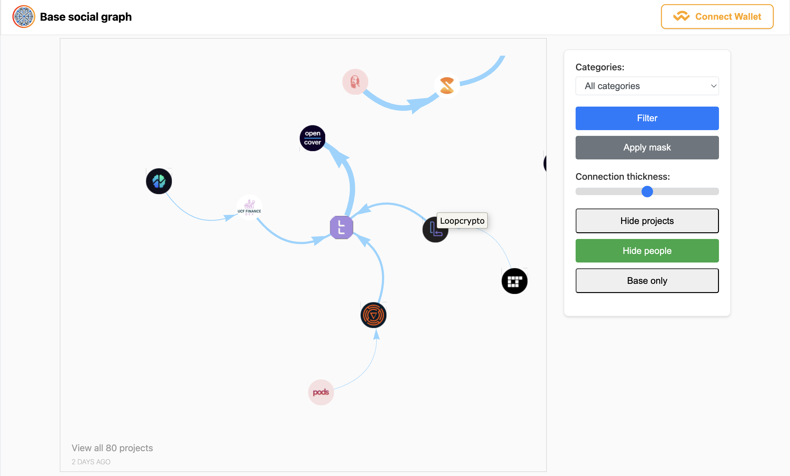
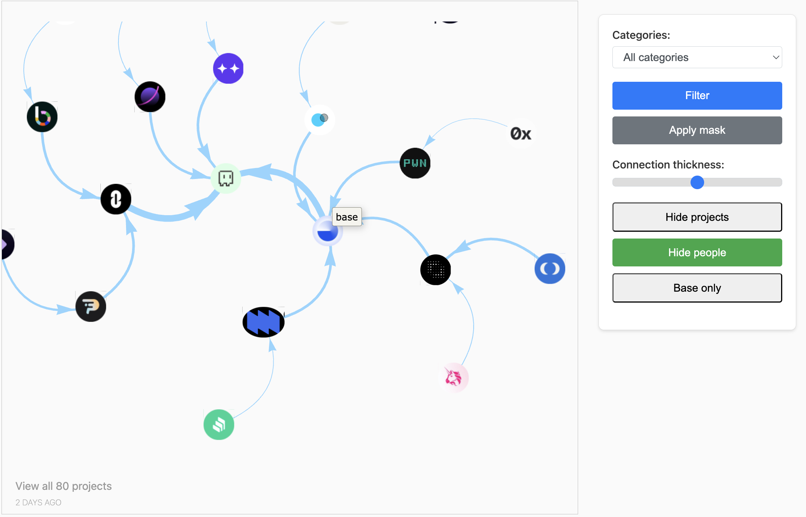
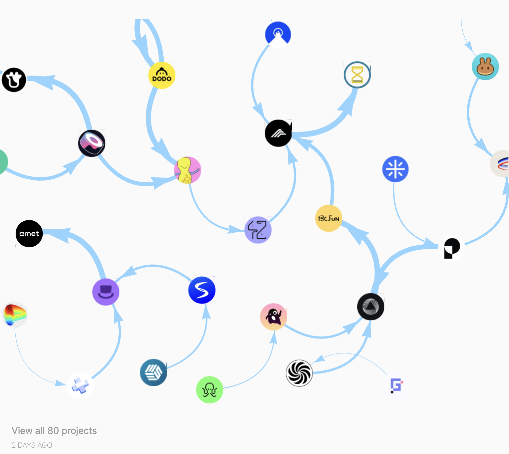
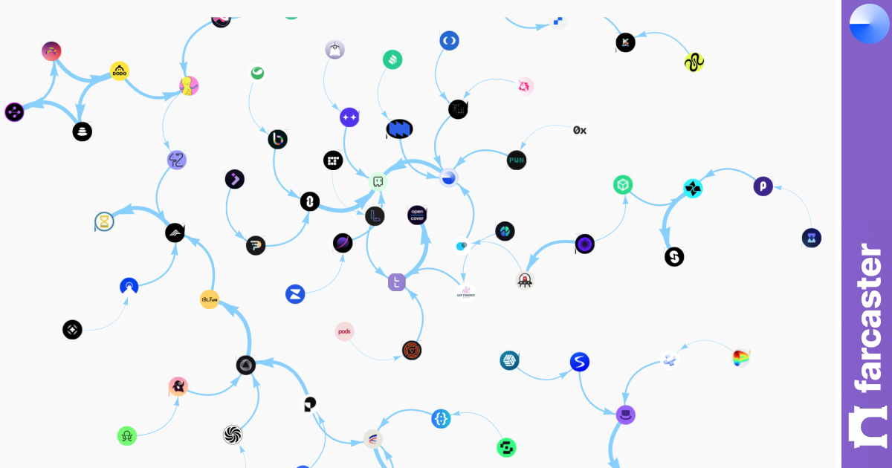

# Base social graph

## Analyze Base forecaster community life cycles using network analysis

The Base ecosystem is rapidly growing, with numerous projects and influencers emerging. However, understanding the complex social dynamics and predicting trends within this community can be challenging using traditional metrics alone.

### Solution

We've developed a tool that leverages network analysis to map and analyze the social fabric of the Base community on Farcaster. By treating the ecosystem as a dynamic social network, we can uncover deeper insights into community trends, project growth, and influencer impact.

### Technical approach

Our data collection process focuses on Farcaster profiles associated with Base projects, influencers, and active community members. Now we mainly gather data on followers and followers.

Using this data, we construct a directional, dynamic graph representing the Base community on Farcaster. We then apply various network analysis algorithms, including: _Temporal PageRank_, _Community Detection_, _Influence Propagation Models_, _Network Growth Analysis_.

These algorithms allow us to:

- Identify emerging influencers and projects before they become widely known
- Track the flow of attention and engagement across the ecosystem
- Predict potential collaborations or project launches based on social signals
- Measure the "community health" of projects over time







### Product

Our tool presents an interactive, visual representation of the Base Farcaster community. Users can explore:

- Project Growth Trajectories. Visualize how a project's network expands and evolves over time.
- Influencer Maps. Identify key opinion leaders and track their impact on different sub-communities.
- Trend Prediction. Highlight emerging topics or projects based on changes in network structure and activity patterns.
- Community Health Metrics. Assess the engagement and growth of different projects or sub-communities within the Base ecosystem.

Currently, users primarily interact with the dynamic graph to make their own predictions and insights. In future versions, we plan to automate many of these functions, providing data-driven analysis and predictions alongside the interactive visualization.

By analyzing these social dynamics, users can gain deeper insights into the Base ecosystem, potentially identifying promising projects early, understanding community sentiment, and making more informed decisions about where to focus their attention or resources within the Base community.

### Usage guide

#### Data part

You can locate the data collection and a portion of the analysis algorithm in their respective folders. To simply view the results, launch the web application.

#### Web app part

```
npm i
```

```
npm run start
```

#### Notice

Additionally, the raw data and most of the algorithms used are closed code. I will create a platform from this and open it to the community later.

Here's a rewritten version of the challenges for the Base Social Graph project:

### Challenges I ran into

- Accessing comprehensive Farcaster data through APIs proved challenging.

- Parsing Farcaster data for all Base projects and their networks takes forever. Had to implement multithreading to make it somewhat manageable, but it's still time-consuming.

- There's a ton of data to mine, clean, and analyze for each graph. The process is pretty chaotic and manual right now. Really need to automate this to scale the platform, but haven't had time to figure it out yet.
